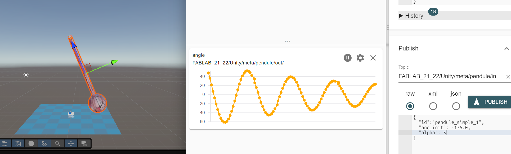

# Unity Meta Quest 3 Project: MQTT Pendulum Simulation

This project is a technical demonstration for the **Meta Quest 3**, featuring a physical simulation of a simple pendulum that can be remotely controlled and monitored using the **MQTT** protocol.

The goal is to study the physics of a pendulum (free fall, viscous friction) while visualizing the model in Unity and controlling the experiment via JSON requests from an external dashboard.

---

## 1. Key Features

- **Native Physics Engine:** Utilizes Unity's native PhysX engine with `Rigidbody` and `Hinge Joint` components for a perfectly realistic, gravity-driven oscillation.
- **Real-Time Telemetry (Out):** The pendulum broadcasts its angular position and elapsed time at high frequency to the MQTT broker.
- **Remote Control (In):** Receives commands to modify the starting angle, the mass, or the viscous friction of the hinge.
- **Zero-Drift Reset:** The control script uses absolute spatial interpolation to smoothly lift the pendulum back to its starting position without "breaking" the Hinge Joint or accumulating rounding errors.

---

## 2. MQTT Architecture

The project integrates an **MQTT Manager** (`MqttManager.cs`) coupled with a script attached to the pendulum (`PendulumMqttPublisher.cs`).

### A. Listening / Remote Control (Topic IN)
The pendulum listens to JSON messages to reset itself or modify its physical properties on the fly.

- **Listen Topic:** `FABLAB_21_22/Unity/metaquest/in` *(configurable in MqttManager)*
- **Example Command JSON:**
```json
{
  "id": "pendule_simple_1",
  "ang_init": 45.0,
  "alpha": 15.0,
  "m": 1.5
}
```
- `id`: The unique identifier of the pendulum in the scene.
- `ang_init`: The starting angle. Unity will perform a **smooth lift** (geometric movement, physics engine frozen) for 3 seconds. During this time, the timer is frozen. Upon release, the free fall begins.
- `alpha`: The viscous damping coefficient (Damper) of the Hinge Joint. Ideal for observing critical or overdamped regimes.
- `m`: (Optional) Modifies the mass of the pendulum.

> **Note:** The variables `ang_init` and `alpha` are **memorized**. If you send only one of these variables (e.g., only `"alpha": 10.0`), the pendulum will use the previous starting angle, and vice versa.

### B. Telemetry / Publication (Topic OUT)
During its free fall, the pendulum publishes its state at regular intervals.

- **Publish Topic:** `FABLAB_21_22/Unity/meta/pendule/out/`
- **Example Output JSON:**
```json
{
  "id": "pendule_simple_1",
  "angle": 60.0,
  "temps": 12.2
}
```
- `id`: Dynamically retrieved from the main parent GameObject's name.
- `angle`: The local angle (`localEulerAngles.x`), corrected to be between -180° and 180°.
- `temps`: The elapsed time in seconds since the last reset/release.

---

## 3. Pendulum Physics Setup in Unity

To recreate or modify the oscillation, here is the expected physical structure in the scene:

#### 1️⃣ Hierarchy
```text
sys_pendule
 ├─ Axe (Axis)
 ├─ Pendule (Pendulum)
 └─ Pivot
```

#### 2️⃣ Axe (Fixed Support)
- **Component:** `Rigidbody`
- **Settings:** `Use Gravity = OFF`, `Is Kinematic = ON`

#### 3️⃣ Pendule (Moving Part)
- **Component:** `Rigidbody`
- **Typical Settings:** `Use Gravity = ON`, `Mass = 1`, `Angular Damping = 0.05 to 0.2` (simulates fluid air friction).

#### 4️⃣ Pivot (Hinge)
- **Component:** `Rigidbody`
- **Settings:** `Use Gravity = OFF`, `Is Kinematic = OFF`

#### 5️⃣ Attaching the Pivot to the Axe
- On the **Pivot**, add a `Fixed Joint`.
- **Setting:** `Connected Body = Axe`. (The pivot remains securely attached to the axis).

#### 6️⃣ Adding Pendulum Rotation
- Still on the **Pivot**, add a `Hinge Joint`.
- **Settings:** `Connected Body = Pendule`, `Anchor = 0 0 0`.

#### 7️⃣ Rotation Axis
- In the `Hinge Joint` -> `Axis`.
- **Settings:** `X=1 Y=0 Z=0` (or depending on desired orientation). Only one axis must be free.

#### 8️⃣ MQTT-Controlled Viscous Friction
The `"alpha"` parameter in the JSON modifies the `Damper` property of the `Spring` included in the `Hinge Joint`. It must be enabled (`Use Spring = true` but with `Spring = 0` to provide only a resistance force without an arbitrary return point).

---

## 4. Prerequisites and Security
Credentials for the MQTT connection are secure and **not committed** to Git. They must be stored locally in `Assets/Resources/secrets.json`.

```json
{
  "mqttAddress": "broker.hivemq.com",
  "mqttPort": 1883,
  "mqttUsername": "",
  "mqttPassword": ""
}
```

---

## 5. Overview



